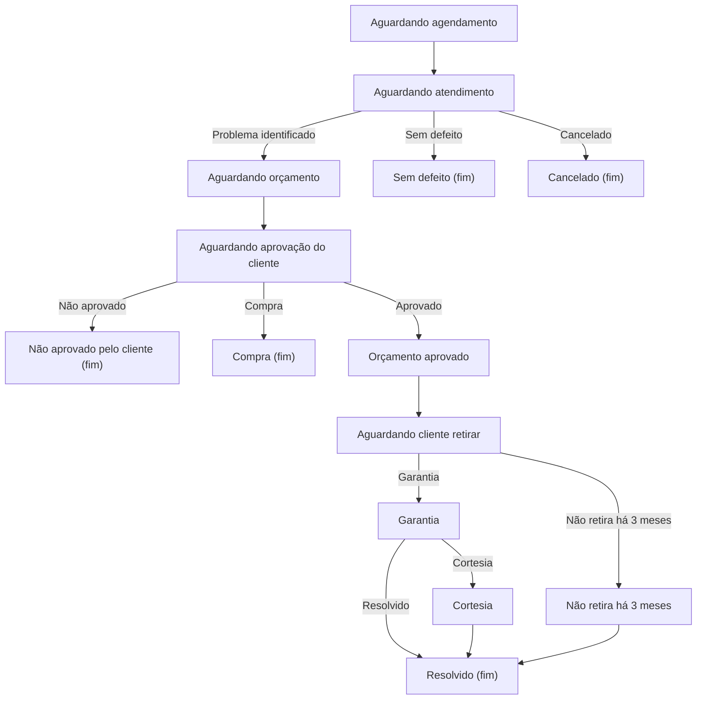
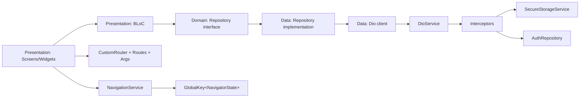
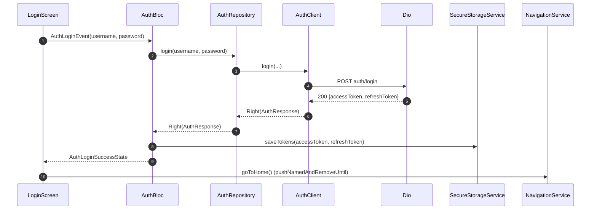
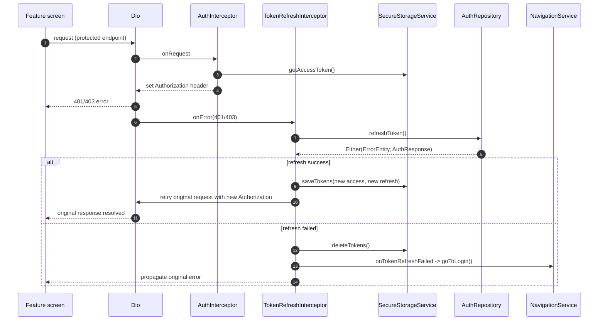

<div style="display: flex; justify-content: center; align-items: center; flex-direction: column;">
    <br>
    
    <hr/>
    <p>
      
    </p>
    <p style="text-align: center">
        Front-end Flutter do sistema Serv-Oeste. A aplicação consome uma API HTTP configurada em <code>lib/core/http/server_endpoints.dart</code>.
    </p>
</div>

<hr/>

## Summary

- [Project overview](#project-overview)
- [Tech stack](#tech-stack)
- [Architecture](#architecture)
- [Folder structure](#folder-structure)
- [State management](#state-management)
- [Networking](#networking)
- [Authentication flow](#authentication-flow)
- [Navigation and routing](#navigation-and-routing)
- [How to run](#how-to-run)

---

## Project overview

This repository contains the Flutter client for a service-management workflow. The implemented responsibilities include:

- **Authentication**: login/logout, persistent token storage, and automatic session recovery by refreshing tokens.
- **Services (`servico`)**: list with filters + pagination, create/update, and a home dashboard that loads a weekly agenda.
- **Clients (`cliente`)** and **Technicians (`tecnico`)**: list/search, create/update, and list delete/disable flows.
- **Users (`user`)**: list, create/update, and delete users (the UI filters out `ADMIN` users from the list view).
- **PDF generation**: budget (`orcamento`), receipt (`recibo`), and visits report (`relatorioVisitas`) generated from service detail context.

### Service lifecycle (UI/status domain)

The status values used by the UI are defined in `lib/core/constants/constants.dart` (`Constants.situationServiceList`). The following diagram documents the supported lifecycle transitions as represented in the project documentation style:



## Tech stack

### Runtime

| Category                  | Choice                                      | Evidence in repo                                                       |
|---------------------------|---------------------------------------------|------------------------------------------------------------------------|
| Language                  | Dart (`>=3.3.0 <4.0.0`)                     | `pubspec.yaml`                                                         |
| Flutter channel           | `stable`                                    | `.metadata`                                                            |
| State management          | `bloc` + `flutter_bloc`                     | `lib/features/**/presentation/bloc/*_bloc.dart`                        |
| DI / service access       | `provider`                                  | `lib/main.dart`, `lib/core/di/app_dependencies.dart`                   |
| HTTP client               | `dio`                                       | `lib/core/http/dio_service.dart` and feature `*_client.dart`           |
| Functional error handling | `Either<L, R>` via `dartz`                  | repositories/clients return `Either<ErrorEntity, T>`                   |
| Secure storage            | `flutter_secure_storage`                    | `lib/core/services/flutter_secure_storage_service.dart`                |
| Cookies                   | `dio_cookie_manager` + `cookie_jar`         | `lib/core/http/dio_service.dart`                                       |
| PDF                       | `pdf` + `printing`                          | `lib/shared/pdfs/*`                                                    |
| Validation                | `lucid_validation` (and feature validators) | e.g. `features/servico/domain/validators/servico_validator.dart` usage |
| Logging                   | `logger`                                    | `lib/core/http/dio_interceptor.dart`, screens                          |

### App entrypoint and wiring

The app is wired in `lib/main.dart` using `MultiBlocProvider` (feature blocs) and `MultiProvider` (shared services like `NavigationService` and `SecureStorageService`).

## Architecture

### Architectural boundaries

The codebase follows a feature-first modular structure with an explicit separation between:

- **Presentation**: Screens/widgets + BLoCs (UI-driven state and orchestration)
- **Domain**: entities, form models, validators, repository interfaces
- **Data**: Dio clients and repository implementations that call the backend

Cross-cutting infrastructure (HTTP, routing, navigation, DI, secure storage) lives under `lib/core/`. Reusable UI and helpers live under `lib/shared/`.

### Dependency graph (high level)



## Folder structure

```text
serv_oeste/
├── lib/
│   ├── main.dart
│   ├── core/
│   │   ├── constants/                 # UI constants and enumerations (e.g., service/technician status lists)
│   │   ├── di/                        # Manual dependency wiring (AppDependencies)
│   │   ├── errors/                    # Error normalization (DioException -> ErrorEntity)
│   │   ├── http/                      # DioService + interceptors + endpoint constants
│   │   ├── navigation/                # NavigationService + AppNavigationService
│   │   ├── routing/                   # Routes, CustomRouter, typed route args
│   │   ├── security/                  # JWT decode helpers used by UI/layout logic
│   │   └── services/                  # Secure storage abstraction + implementation
│   ├── features/
│   │   ├── auth/                      # login/logout + token persistence
│   │   ├── home/                      # weekly agenda dashboard (services)
│   │   ├── servico/                   # services: list/filter/create/update + PDF actions on detail
│   │   ├── cliente/                   # clients: list/search/create/update/delete list
│   │   ├── tecnico/                   # technicians: list/search/create/update/disable list
│   │   ├── user/                      # users: list/create/update/delete
│   │   └── endereco/                  # address feature (data/domain/presentation present)
│   └── shared/
│       ├── bloc/                      # BaseEntityBloc + ListaBloc (multi-select state for lists)
│       ├── models/                    # ErrorEntity, PageContent, enums
│       ├── pdfs/                      # PDF builders using pdf/printing
│       ├── utils/                     # formatters, debouncer, extensions
│       └── widgets/                   # base screens, form fields, layout components
└── pubspec.yaml
```

## State management

### BLoC conventions

Feature blocs live under `lib/features/<feature>/presentation/bloc/` and typically:

- extend `BaseEntityBloc<Event, State>` (`lib/shared/bloc/base_entity_bloc.dart`)
- declare `part '<feature>_event.dart'` and `part '<feature>_state.dart'`
- expose list/search and CRUD events, emitting typed states consumed by screens via `BlocBuilder`, `BlocConsumer`, and `BlocListener`.

#### `BaseEntityBloc.handleRequest` contract

`BaseEntityBloc` centralizes a common “emit loading → call repository → emit error or run success callback” pattern. Conceptually:

```dart
Future<void> handleRequest<T>({
  required Emitter<State> emit,
  required Future<Either<ErrorEntity, T>> Function() request,
  required FutureOr<void> Function(T result) onSuccess,
  void Function(ErrorEntity error)? onError,
  State? loading,
});
```

This is the core mechanism used by `AuthBloc`, `ClienteBloc`, `TecnicoBloc`, `ServicoBloc`, `EnderecoBloc`, and `UserBloc`.

### List screens: selection and pagination

List screens implement a shared UX pattern via:

- `BaseListScreen<T>` / `BaseListScreenState<T>` (`lib/shared/widgets/screen/base_list_screen.dart`)
  - shared navigation helpers (`onNavigateToCreateScreen`, `onNavigateToUpdateScreen`)
  - debounced search (`Debouncer`)
  - shared grid/list rendering + pagination wiring
- `ListaBloc` (`lib/shared/bloc/list/lista_bloc.dart`)
  - maintains `selectedIds` for multi-select mode
  - used by screens like `ClienteScreen`, `TecnicoScreen`, `ServicoScreen` to switch FAB actions based on selection state.

### Forms and validation

There are two form patterns:

1. **Feature-specific forms** using domain form objects and validators (e.g., `ServicoUpdateScreen` uses `ServicoForm`, `ClienteForm`, and `ServicoValidator`).
2. **Reusable form renderer**: `BaseEntityForm` (`lib/shared/widgets/screen/base_entity_form.dart`) which:
   - builds responsive rows from `SearchInputField` descriptors (`TextFormInputField`, `DropdownInputField`, `DatePickerInputField`, etc.)
   - disables inputs while the provided `isLoading(state)` predicate is true
   - shows SnackBars and pops the route (`Navigator.pop(context, true)`) on success.

## Networking

### Endpoints

The backend base URL and endpoint paths are defined in `lib/core/http/server_endpoints.dart`.

| Item             | Value                                                                       |
|------------------|-----------------------------------------------------------------------------|
| Base URL         | `http://localhost:8080/api/`                                                |
| Auth endpoints   | `auth/login`, `auth/refresh`, `auth/logout`                                 |
| Domain endpoints | `user`, `tecnico`, `cliente`, `servico`, `endereco` (plus `find` endpoints) |

### Dio configuration

`DioService` (`lib/core/http/dio_service.dart`) builds a single Dio instance with:

- `BaseOptions(baseUrl, json contentType/responseType, 10s timeouts)`
- cookie persistence via `CookieManager(CookieJar())`
- optional dev logging (`DioInterceptor`) when `Constants.isDev == true`
- authentication interceptors added once via `addAuthInterceptors(...)`.

### Interceptors

| Interceptor                 | Added by                                        | Purpose                                                                                   |
|-----------------------------|-------------------------------------------------|-------------------------------------------------------------------------------------------|
| `CookieManager`             | `DioService` constructor                        | attaches cookie jar to all requests                                                       |
| `DioInterceptor` (dev only) | `DioService` constructor when `Constants.isDev` | request/response logging and cookie header cleanup                                        |
| `AuthInterceptor`           | `DioService.addAuthInterceptors`                | injects `Authorization: Bearer <accessToken>` if available                                |
| `TokenRefreshInterceptor`   | `DioService.addAuthInterceptors`                | refreshes tokens on `401/403`, retries failed requests, and redirects to login on failure |

### Error normalization

All Dio clients map `DioException` into a shared `ErrorEntity` via `ErrorHandler.onRequestError(...)` (`lib/core/errors/error_handler.dart`).

## Authentication flow

### Login, token persistence, and navigation to Home



### Automatic token refresh on expired session

`TokenRefreshInterceptor` intercepts `401` and `403` responses (except refresh endpoint), performs a single refresh in-flight, queues concurrent failing requests, then retries them with the updated access token. On refresh failure it deletes stored tokens and triggers `NavigationService.goToLogin()`.



## Navigation and routing

### Router model

The app uses named routes with a single router entrypoint:

- `MaterialApp.onGenerateRoute` -> `CustomRouter.onGenerateRoute` (`lib/core/routing/custom_router.dart`)
- Route names are constants in `lib/core/routing/routes.dart`
- Arguments are passed via typed args classes in `lib/core/routing/args/` and cast inside `CustomRouter`.

### Routes map

| Route constant         | Path             | Screen/widget             | Arguments                                                 |
|------------------------|------------------|---------------------------|-----------------------------------------------------------|
| `Routes.home`          | `/home`          | `BaseLayout`              | none                                                      |
| `Routes.login`         | `/login`         | `LoginScreen`             | none                                                      |
| `Routes.tecnico`       | `/tecnico`       | `TecnicoScreen`           | none                                                      |
| `Routes.tecnicoCreate` | `/createTecnico` | `TecnicoCreateScreen`     | none                                                      |
| `Routes.tecnicoUpdate` | `/updateTecnico` | `TecnicoUpdateScreen`     | `TecnicoUpdateArgs { id }`                                |
| `Routes.cliente`       | `/cliente`       | `ClienteScreen`           | none                                                      |
| `Routes.clienteCreate` | `/createCliente` | `ClienteCreateScreen`     | none                                                      |
| `Routes.clienteUpdate` | `/updateCliente` | `ClienteUpdateScreen`     | `ClienteUpdateArgs { id }`                                |
| `Routes.servico`       | `/servico`       | `ServicoScreen`           | none                                                      |
| `Routes.servicoCreate` | `/createServico` | `ServicoCreateScreen`     | `ServicoCreateArgs { isClientAndService }`                |
| `Routes.servicoUpdate` | `/updateServico` | `ServicoUpdateScreen`     | `ServicoUpdateArgs { id, clientId }`                      |
| `Routes.servicoFilter` | `/filterServico` | `ServicoFilterFormWidget` | `ServicoFilterFormArgs { bloc, title, submitText, form }` |
| `Routes.user`          | `/user`          | `UserScreen`              | none                                                      |
| `Routes.userCreate`    | `/createUser`    | `UserCreateScreen`        | none                                                      |
| `Routes.userUpdate`    | `/updateUser`    | `UserUpdateScreen`        | `UserUpdateArgs { id, username, role }`                   |

### Global navigation (`NavigationService`)

The project defines a minimal `NavigationService` abstraction to support navigation outside widget contexts. `AppNavigationService` holds a `GlobalKey<NavigatorState>` and performs stack resets via:

- `goToLogin()` -> `pushNamedAndRemoveUntil(Routes.login, (_) => false)`
- `goToHome()` -> `pushNamedAndRemoveUntil(Routes.home, (_) => false)`

This is used by infrastructure (token refresh failure callback) and by the login screen after successful authentication.

### Shell layout and nested navigators

The home shell (`BaseLayout`) implements a tabbed UX with independent navigation stacks per tab:

- A list of `GlobalKey<NavigatorState>` is created for each tab.
- Each tab is rendered via an `Offstage` `Navigator`, so switching tabs keeps the per-tab stack.

```mermaid
flowchart TD
  App[MaterialApp] --> Router[CustomRouter]
  Router --> BaseLayout[BaseLayout /home]
  BaseLayout --> Nav0[Navigator Tab 0]
  BaseLayout --> Nav1[Navigator Tab 1]
  BaseLayout --> Nav2[Navigator Tab 2]
  BaseLayout --> Nav3[Navigator Tab 3]
  BaseLayout --> Nav4[Navigator Tab 4 (admin only)]
```

## How to run

### Prerequisites

This client expects a backend API reachable at `ServerEndpoints.baseUrl` (default: `http://localhost:8080/api/`). The value is hardcoded in `lib/core/http/server_endpoints.dart`.

### Install dependencies

```bash
flutter pub get
```

### Run

```bash
flutter run
```

### Configuration

No environment-variable based configuration is implemented in this repository (no dotenv usage). Configuration points present in code:

| Key                | Location                              | Notes                                       |
|--------------------|---------------------------------------|---------------------------------------------|
| API base URL       | `lib/core/http/server_endpoints.dart` | `ServerEndpoints.baseUrl`                   |
| Dev logging toggle | `lib/core/constants/constants.dart`   | `Constants.isDev` controls `DioInterceptor` |

---

