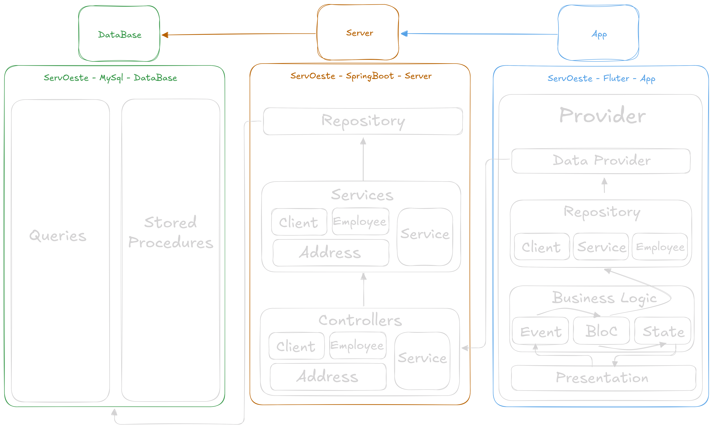

     
    
    

  

      
  

Um projeto da criação de uma API utilizando <a href="https://spring.io/projects/spring-boot">Spring Boot</a> junto do seu consumo em uma aplicação <a href="https://flutter.dev">Flutter</a> utilizando MySql como o banco de dados.

  # Projeção do Sistema
  
  

